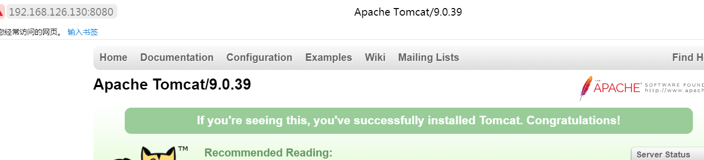

# OpenGrok阅读AOSP代码
为了浏览大规模代码 AOSP，androidref.com网站速度太慢，在本地Ubuntu20.4系统中上构建了opengrok环境，过程记录如下：

## 安装依赖
根据 https://oracle.github.io/opengrok/ 描述
需要安装JDK，11以上；servlet容器，我选择tomcat；以及解析工具**Universal** ctags, 注意不是exuberant-ctags，exuberant-ctags已经不维护了。
### 安装java 11

如果没有安装java，输入java系统提升如下：
```bash
july@july:~$ java

Command 'java' not found, but can be installed with:

sudo apt install default-jre              # version 2:1.11-72, or
sudo apt install openjdk-11-jre-headless  # version 11.0.9+11-0ubuntu1~20.04
sudo apt install openjdk-8-jre-headless   # version 8u272-b10-0ubuntu1~20.04
sudo apt install openjdk-13-jre-headless  # version 13.0.4+8-1~20.04
sudo apt install openjdk-14-jre-headless  # version 14.0.2+12-1~20.04

```

我安装最低要求11，安装完后检查下：
```bash
july@july:~$ java --version
openjdk 11.0.9 2020-10-20
OpenJDK Runtime Environment (build 11.0.9+11-Ubuntu-0ubuntu1.20.04)
OpenJDK 64-Bit Server VM (build 11.0.9+11-Ubuntu-0ubuntu1.20.04, mixed mode, sharing)


```
## 安装Tomcat
官方安装指导：https://tomcat.apache.org/tomcat-9.0-doc/building.html


下载tomcat9二进制：

```bash
july@july:~/bin$ wget https://archive.apache.org/dist/tomcat/tomcat-9/v9.0.39/bin/apache-tomcat-9.0.39.zip

```
官网如太慢可以使用镜像网站替换：

https://mirrors.cnnic.cn/apache/tomcat/tomcat-9/v9.0.39/bin/apache-tomcat-9.0.39.zip

```bash
unzip apache-tomcat-9.0.39.zip

#增加执行权限
chmod a+x -R ./apache-tomcat-9.0.39

#执行启动
cd ~/bin/apache-tomcat-9.0.39/bin

 ./catalina.sh start

```

打开8080端口查看到如下，说明tomcat9安装成功：



## 安装 universal-ctags

Ubuntu20.04可以在apt中直接安装，虽然不是最新的版本。

```bash
sudo apt install universal-ctags
```

查看ctags的版本，检查是否生效：
```bash
july@july:~$ ctags --version
Universal Ctags 0.0.0, Copyright (C) 2015 Universal Ctags Team
Universal Ctags is derived from Exuberant Ctags.
Exuberant Ctags 5.8, Copyright (C) 1996-2009 Darren Hiebert
  Compiled: Jan  6 2019, 23:23:29
  URL: https://ctags.io/
  Optional compiled features: +wildcards, +regex, +iconv, +option-directory, +xpath, +json, +interactive, +sandbox, +yaml

```

# 安装OpenGrok

## 安装python3 工具
```
sudo apt-get install python3-venv python3-pip

```

## 下载release

```bash
wget https://github.com/oracle/opengrok/releases/download/1.5.7/opengrok-1.5.7.tar.gz

 tar xzf opengrok-1.5.7.tar.gz
 cd opengrok-1.5.7/tools/

 python3 -m pip install opengrok-tools.tar.gz

  
```
将以下代码添加到~/.bashrc，然后执行``` source ~/.bashrc```重新加载

```bash

export PATH=~/.local/bin:$PATH

```

## 部署tomcat webapp

```
opengrok-deploy -c /devdata/projects/opengrok/aosp/etc/configuration.xml \
    /devdata/projects/opengrok-1.5.7/lib/source.war /home/july/bin/apache-tomcat-9.0.39/webapps
```

## 建立索引

```bash
    -c /usr/bin/ctags \
opengrok-indexer \
    -J=-Djava.util.logging.config.file=/devdata/projects/opengrok/aosp/etc/logging.properties \
    -a /devdata/projects/opengrok-1.5.7/lib/opengrok.jar -- \
    -s /devdata/projects/aosp -d /devdata/projects/opengrok/aosp/data -H -P -S -G \
    -W /devdata/projects/opengrok/aosp/etc/configuration.xml -U http://localhost:8080/source

```

至此就可以等待索引完成，就可以浏览了。


# docker方式

官方提供了官方的docker镜像： https://github.com/oracle/opengrok/blob/master/docker/README.md，但官方介绍说大规模工程性能不好，所以我没有尝试。